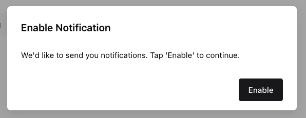
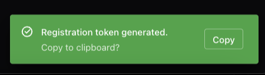

# Firebase Cloud Messaging Playground

This is a demo project showcasing Firebase Cloud Messaging (FCM) in a modern React app.
It is based on my [react-ts-boilerplate](https://github.com/tyalau/react-ts-boilerplate) Git Template Repository.

**[View Demo](https://react-fcm-playground.web.app/)**

## Technologies

- [**React**](https://react.dev/) – A JavaScript library for building user interfaces.
- [**TypeScript**](https://www.typescriptlang.org/) – Statically typed JavaScript for an improved development experience.
- [**Vite**](https://vitejs.dev/) – A fast build tool and development server.
- [**Chakra UI**](https://chakra-ui.com/) – A simple, modular React component library.

## Development Tools

- [**Commitlint**](https://commitlint.js.org/) – Enforces conventional commit messages.
- [**Prettier**](https://prettier.io/) – Ensures consistent code formatting and import order.
- [**ESLint**](https://eslint.org/) – Lints code to maintain quality and prevent errors.
- [**Lint-staged**](https://github.com/okonet/lint-staged) - Runs pre-commit checks on staged files, ensuring only formatted code is committed.
- [**Vitest**](https://vitest.dev/) – A unit testing framework.
- [**Changeset**](https://github.com/changesets/changesets) – Manages versioning and changelogs.
- [**GitHub Actions**](https://github.com/features/actions) - Automates linting, testing, and formatting in CI.

## Prerequisites

Ensure you have the followings:

- [Node.js](https://nodejs.org/) (>= v22.16.0)
- [PNPM](https://pnpm.io/) (>= v10.6.3)
- A [Firebase project](https://firebase.google.com/) with Cloud Messaging enabled
  (and VAPID key + web app credentials generated)

## Getting Started

Clone the repository:

```bash
git clone <repo-url>
cd <project-directory>
```

Install dependencies:

```bash
pnpm install
```

Set up your environment variables:

```bash
cp .env.sample .env.local
```

Edit `.env.local` with your Firebase config:

```env
VITE_FIREBASE_API_KEY=your-firebase-api-key
VITE_FIREBASE_AUTH_DOMAIN=your-project-id.firebaseapp.com
VITE_FIREBASE_PROJECT_ID=your-project-id
VITE_FIREBASE_STORAGE_BUCKET=your-project-id.appspot.com
VITE_FIREBASE_MESSAGING_SENDER_ID=your-sender-id
VITE_FIREBASE_APP_ID=your-app-id
VITE_FIREBASE_VAPID_KEY=your-public-vapid-key
```

Edit `.firebaserc` with your project ID if you would like to use the Firebase CLI.

Run the dev server:

```bash
pnpm dev
```

## Available Scripts

- `pnpm build` – Build the app for production with env variables.
- `pnpm build:env` – Build with custom environment (e.g. `ENV=dev pnpm build:env`).
- `pnpm lint` – Run ESLint for code quality.
- `pnpm prettier:fix` – Format code using Prettier.
- `pnpm test` – Run unit tests with Vitest.
- `pnpm test:watch` – Watch mode for tests.
- `pnpm test:ui` – Launch the Vitest UI for interactive test execution.

## How to Use

1. On page load, a modal will appear asking you to enable notifications.

   

2. Click **"Enable"** to request notification permission from the browser.

   

3. If permission is granted:

   - A success toast will appear, and you can click **"Copy"** to copy the token to your clipboard.

     

   - Your FCM token will also be displayed in a text field.

     

4. You can compose and preview the payload (learn more about [message types](https://firebase.google.com/docs/cloud-messaging/concept-options#notifications_and_data_messages)):

   - **Notification Message**

     

     ```json
     {
       "message": {
         "token": "<fcm_token>",
         "notification": {
           "title": "Simple Message",
           "body": "This is a test message from the FCM v1 API"
         }
       }
     }
     ```

   - **Data Message**

     You can define the key-value pairs:

     

     ```json
     {
       "message": {
         "token": "<fcm_token>",
         "data": <your_custom_data_payload>
       }
     }
     ```

     To customize the payload, update the following files:

     - [`DataMessage`](./src/types/notification.ts): Defines the data payload.
     - [`composeNotification`](./src/utils/notification.ts): Handles how the data payload is converted into a notification.

5. You may copy the payload and send push notifications via the [Firebase Cloud Messaging v1 API](https://firebase.google.com/docs/reference/fcm/rest/v1/projects.messages/send), or click "Try in API Explorer" and open the API url with the project ID and payload prefilled.

   

## Deployment

This project is deployed to Firebase Hosting using GitHub Actions.

You can find the workflow at:
[`.github/workflows/firebase-hosting.yml`](.github/workflows/firebase-hosting-merge.yml)
